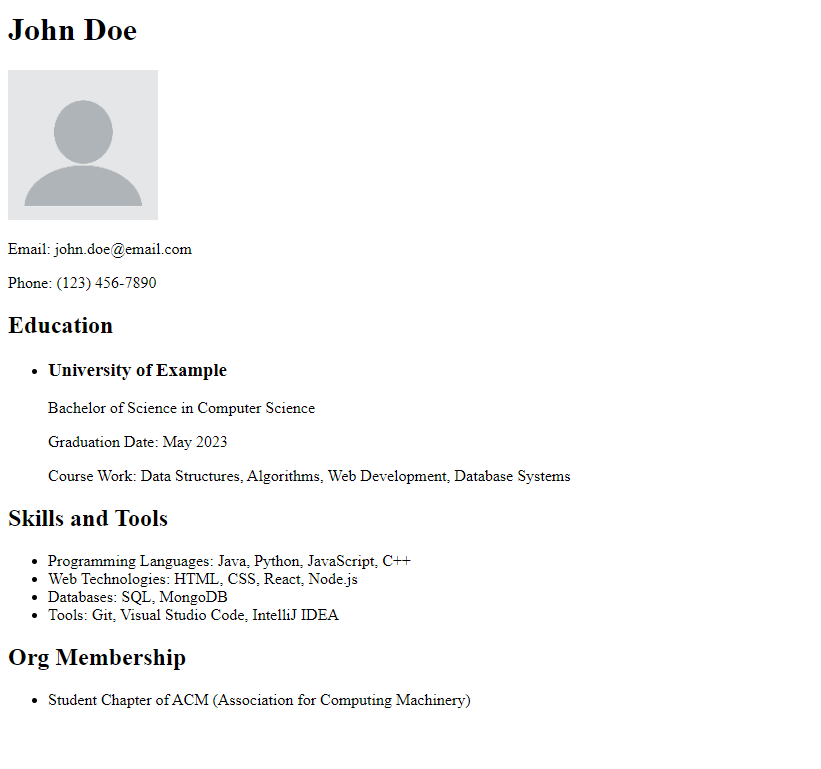

# Week 1: Setup, Tools, and HTML 

# Materials
- [Day 1: Setup and Git](https://docs.google.com/presentation/d/1u8HjlkeVglOqGz3u65VjJmJN6CLDBBuE/edit?usp=drive_link&ouid=109884877973910636402&rtpof=true&sd=true)
- [Day 2: HTML](https://docs.google.com/presentation/d/1eABkgbm8yLI0xGWd9a5tFVzKKKe49TNQ/edit?usp=drive_link&ouid=109884877973910636402&rtpof=true&sd=true)

## Commonly Used Terminal Commands

In this section, we'll introduce some basic terminal commands that will be useful throughout the course:

1. **Navigate the File Directory**:
- `ls`: List the contents of the current directory.
- `cd <directory>`: Change the current working directory.

2. **Basic Git Commands**:
- `git add <file>`: Stage a file for commit.
- `git commit -m "<message>"`: Commit the staged changes with a message.
- `git push`: Push your local commits to the remote repository.
- `git pull`: Pull the latest changes from the remote repository.

Remember, these are just the basics, and we'll cover more advanced terminal commands and git workflows as we progress through the course.

# Homework # 1: HTML Resume
It's recruiting season which means that you'll need a resume to show the world your skills and experiences. The goal of this homework assignment is to familiarize you with HTML, so play around with different tags and formats. Don't worry about making the resume pretty, we'll do that next week when we learn CSS :)
## Instructions
Make sure you have a text editor installed (ie. vscode) on your machine before proceeding. 

You'll be coding out the resume in only HTML code this week. Try to make it as similar as possible to the example provided. Next week, after y'all have learned CSS, we'll add CSS on top of the HTML resume to format it differently and make it a bit prettier.

### Target Output

Your HTML resume should look similar to the following image:

1.	Open your text editor of choice inside the `homework` directory.
2.	Create a new file called `resume.html`.
3.  Your HTML resume should include the following sections:

    - **Name**
    - **Profile Picture**
    - **Email**
    - **Phone Number**
    - **Education Section**
        - School
        - Major
        - Graduation Date
        - Course Work
    - **Skills and Tools**
    - **Org Membership**

Remember to structure your HTML properly, using appropriate tags for headings, lists, paragraphs, and images. Try to make your code as organized and readable as possible.

## Running and Testing Your HTML File

There are several ways to run and test your HTML file:

1. **Live Server Extension**: If you're using Visual Studio Code, you can install the "Live Server" extension. This extension allows you to launch a local development server and view your HTML file in real-time.

2. **Opening the File Directly**: You can also open the HTML file directly in your file explorer or Finder. Simply double-click the file, and it should open in your default web browser.

## Final Note

While creating your HTML resume, refer to the provided image as a guide, and try to make yours look similar. This is because the example resume will be added onward next week, when we add CSS. The goal is to familiarize yourself with HTML tags and structure this week. We'll enhance the styling and visual appearance of your resume using CSS in the next week's homework assignment.

Good luck, and happy coding!

# HW # 2: Git Katas (optional)
It is now time to grow and sharpen your skills with Git! It's a very useful skill that is always better
to learn now versus later :) 
Git Katas: https://github.com/eficode-academy/git-katas

## Instructions
To set up the Git Katas, follow the instructions on the README of the repo linked above.
Here are some general instructions for set up:
1. Once in the appropriate directory, clone the repo by typing "git clone https://github.com/praqma-training/git-katas.git" 
into the terminal.
2. cd (change directory) into git-katas
3. Choose and cd into the desired exercise
4. Once in the exercise directory run the set-up script by typing ". ./setup.sh" in the terminal.
5. Follow the instructions for the exercise to completion!

In class, we are planning to demo the "Basic Commits" and "Basic Staging" exercises. Please complete those if
you did not make it to class and on your own complete (at least) the following exercises (feel free to do more!):
- Basic Branching
- Basic Revert
- Merge Conflict

# Additional Resources
- [Navigating VsCode for Beginners](https://youtu.be/ORrELERGIHs)
- [HTML Tags Cheat Sheet](https://html.com/wp-content/uploads/html5_cheat_sheet_tags.png) 
- [HTML in 1 Hour Video](https://www.youtube.com/watch?v=iphTU2NFZCI)
- [Git in 1 Hour](https://youtu.be/8JJ101D3knE)
- [Git Katas](https://github.com/eficode-academy/git-katas)
   - [basic-commits](https://github.com/eficode-academy/git-katas/tree/master/basic-commits)
   - [basic-staging](https://github.com/eficode-academy/git-katas/tree/master/basic-staging)
   - [basic-branching](https://github.com/eficode-academy/git-katas/tree/master/basic-branching)
   - [basic-revert](https://github.com/eficode-academy/git-katas/tree/master/basic-revert)
   - [basic-merge-conflict](https://github.com/eficode-academy/git-katas/tree/master/merge-conflict)