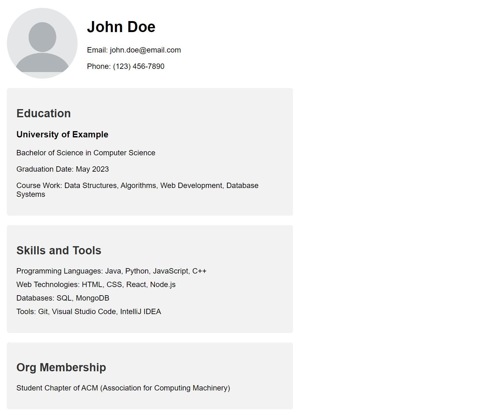

# Week 2: CSS + Javascript

Welcome to week 2! We hope you had a great week 1 since this is where the course will ramp up a tiny bit. We're going to be teaching y'all the basics of CSS and Javascript in the browser.

# Materials
- [Day 3: CSS](https://docs.google.com/presentation/d/12X6YKqnyvdNapMTTODEnpiTYYLjKtu4T/edit?usp=sharing&ouid=117392730020260659840&rtpof=true&sd=true)
- [Day 4: Javascript](https://docs.google.com/presentation/d/1essRh0WoaFv948jVREw5WqM4Y3cPEr0n/edit?usp=sharing&ouid=117392730020260659840&rtpof=true&sd=true)

- [Intro to Javascript Slides: ](https://drive.google.com/drive/folders/1Ji7U3P1Siq0I-QAoYcsqdbepSrWaujDq?usp=sharing) we highly recommend you get familiarized with the basics of Javascript before Week 3 (loops, conditionals, etc), and have provided the Javascript slides from Spring 2022.

# Homework #2: CSS Styling for HTML Resume

In the previous week, we learned how to structure a resume using HTML. This week, we'll be exploring CSS to enhance the visual appearance of our resume and make it more appealing.

## Target Output

Your styled HTML resume should look similar to the following image:

## Instructions

1. Start with the HTML resume you created in the previous homework assignment.

2. Create a new CSS file (e.g., `styles.css`) and link it to your HTML file using the `<link>` element in the `<head>` section.

3. Experiment with different CSS properties and selectors to style your resume. Here are some suggestions:
  - Use CSS selectors like `body`, `header`, `main`, `section`, `h1`, `h2`, `h3`, `p`, `ul`, `li`, and `img` to target specific elements.
  - Set fonts, colors, margins, padding, and background colors for different elements.
  - Style the layout using CSS properties like `display`, `flex`, `justify-content`, and `align-items`.

4. Pay special attention to the following sections and elements:
  - **Header**: Style the header section to make your name and contact information stand out.
  - **Education Section**: Use CSS to create a visually appealing layout for your education details.
  - **Skills and Tools**: Consider using CSS to display your skills and tools in a neat and organized manner (e.g., using a grid layout or flexbox).
  - **Org Membership**: Style the organization membership section to match the overall design of your resume.

5. Refer to the provided image for inspiration, but feel free to get creative with your own design choices.

6. Test your styled resume by opening the HTML file in a web browser or using a live server extension in your text editor.

## Additional Tips

- Use CSS comments to organize and document your CSS code.
- Leverage online resources and documentation for CSS properties, selectors, and techniques.
- Experiment with different font families, sizes, and styles to find the perfect combination for your resume.

Remember, styling with CSS is an iterative process, so don't be afraid to make changes and experiment until you achieve the desired look and feel for your resume.

Good luck, and happy coding!

## Commonly Used Terminal Commands (cont.)

1. **Navigate the File Directory**:
- `ls`: List the contents of the current directory.
- `cd <directory>`: Change the current working directory.

2. **Basic Git Commands**:
- `git add <file>`: Stage a file for commit.
- `git commit -m "<message>"`: Commit the staged changes with a message.
- `git push`: Push your local commits to the remote repository.
- `git pull`: Pull the latest changes from the remote repository.

